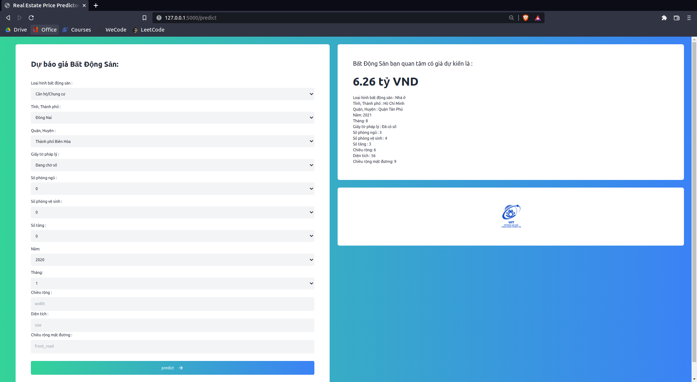

### Deploy Real Estate Predictor
- Model : Random Forest Regression
- R2 Score: 0.84
- Link: https://drive.google.com/file/d/1lArzpvF3cCopgJTtEX3yF7EsyTns0wv7
## Local Installation

It's easy to install and run it on your computer.

```shell
# 1. First, clone the repo
$ git clone git@github.com:hoanshiro/BDSDeploy.git
$ cd BDSDeploy

# 2. Install Python packages
$ pip install -r requirements.txt

# 3. Run!
$ python app.py
```

Open http://localhost:5000 and have fun. :smiley:

<p align="center">
  
</p>
